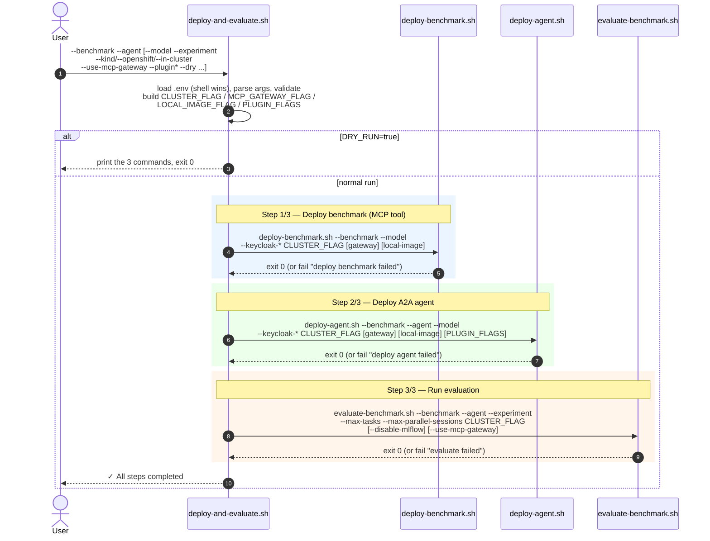
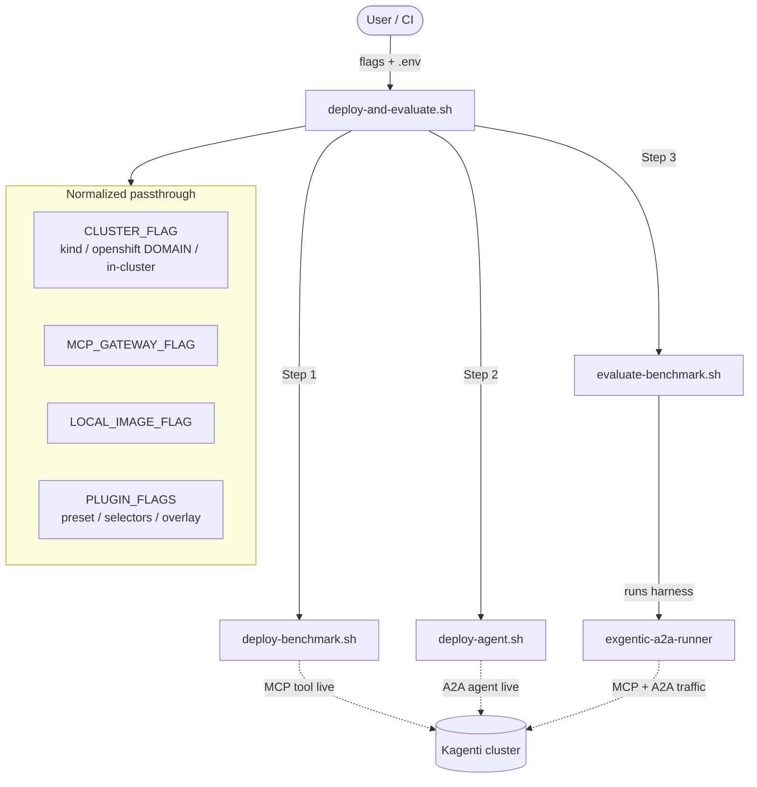
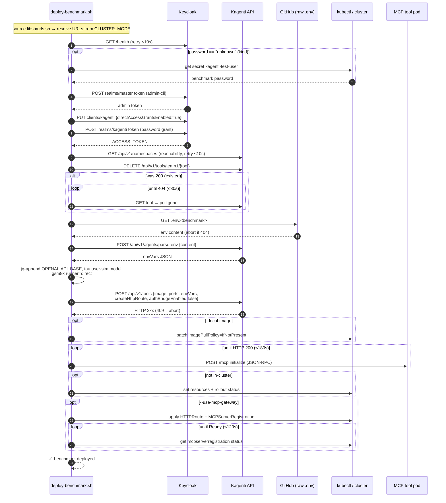
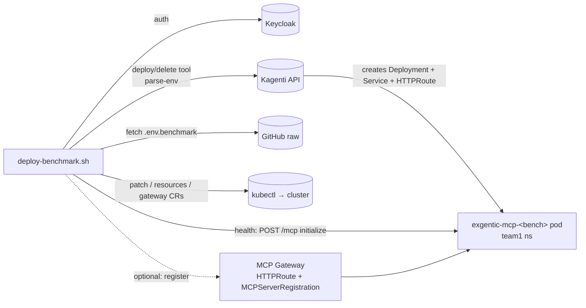
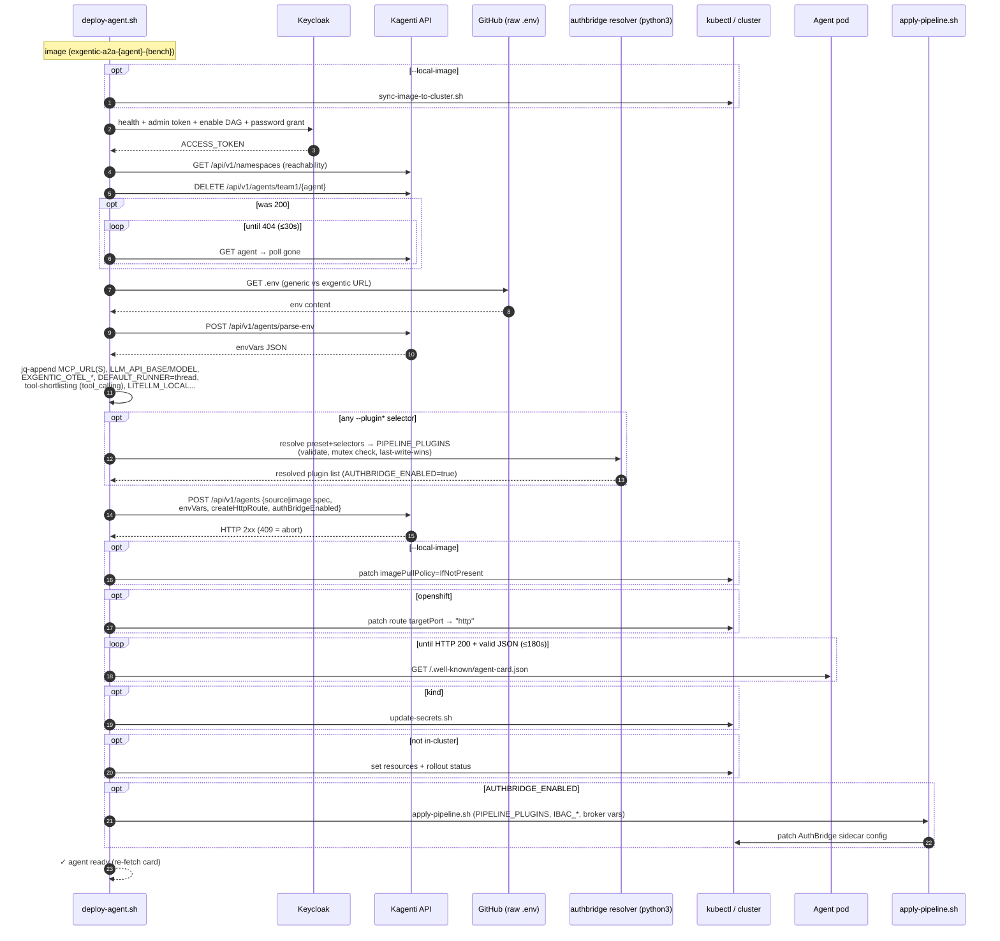
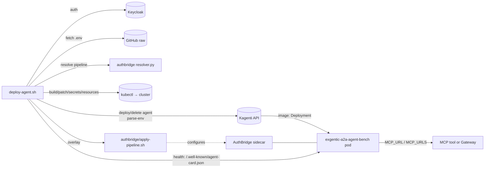
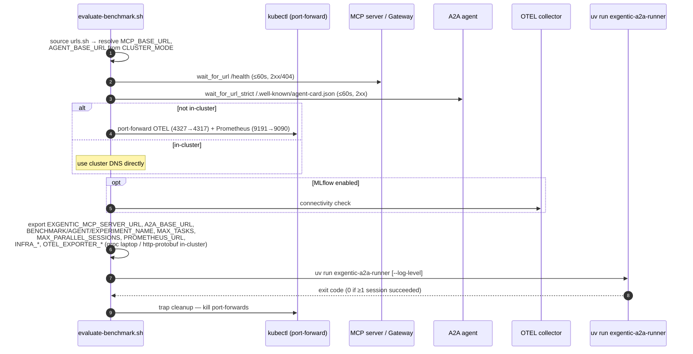
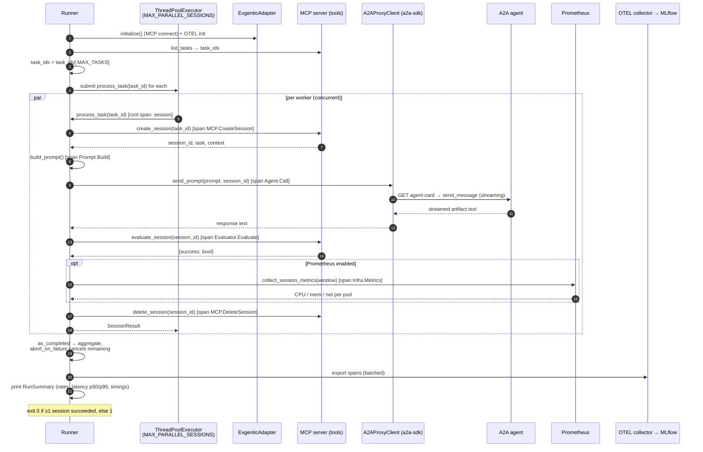
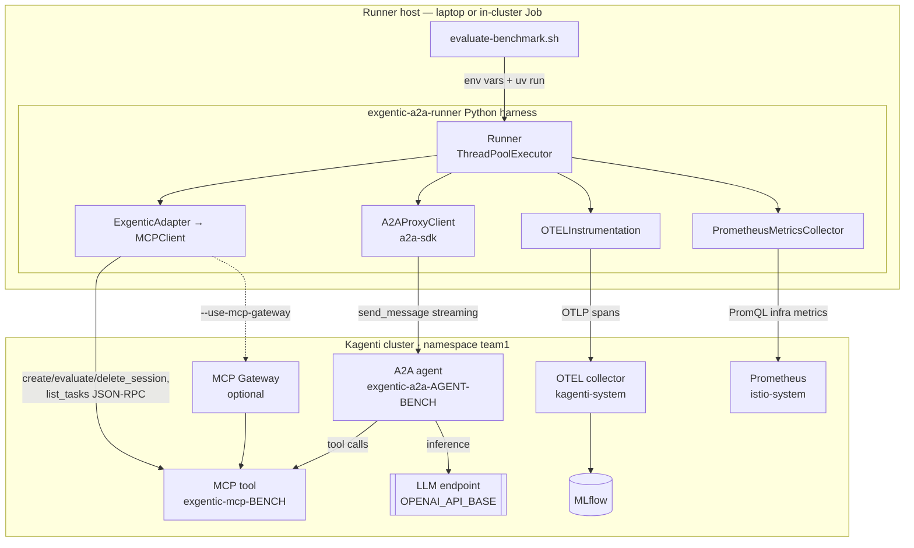

# Exgentic A2A Runner — Workflow Diagrams

This document describes the evaluation flow across the three orchestration
scripts and the Python harness they ultimately launch:

| Script | Role |
|---|---|
| `deploy-and-evaluate.sh` | Top-level orchestrator — runs the three steps below in sequence |
| `deploy-benchmark.sh` | Deploys the benchmark as an **MCP tool** (the session/eval backend) via the Kagenti API |
| `deploy-agent.sh` | Deploys the **A2A agent**  via the Kagenti API, optionally with an AuthBridge sidecar  |
| `evaluate-benchmark.sh` | Wires up endpoints + telemetry, then runs the Python harness `exgentic-a2a-runner` |
| `exgentic_a2a_runner/*.py` | The harness itself — drives MCP sessions + A2A calls per task, emits OTEL traces |

Every script shares `libsh/urls.sh`, which resolves service URLs from
`CLUSTER_MODE` (`--kind` / `--openshift DOMAIN` / `--in-cluster`).

Diagrams are in [Mermaid](https://mermaid.js.org/) and render on GitHub, VS Code,
and most Markdown viewers. Each of the four flows below has **(1)** a UML-style
sequence (interaction) diagram and the section ends with **(2)** an overall
architecture diagram.

---

## 1. `deploy-and-evaluate.sh` — end-to-end orchestration

The orchestrator parses flags then calls the three
sub-scripts in order. Any non-zero exit aborts via `fail`. `--dry` prints the
commands instead of running them.

### 1.1 Interaction diagram

### 1.2 Component view

---

## 2. `deploy-benchmark.sh` — deploy the benchmark MCP tool

Authenticates to Keycloak (auto-fetching / enabling Direct Access Grants),
deletes any existing tool (waiting for async cleanup), fetches + parses the
benchmark `.env` through the Kagenti `parse-env` API, augments it with runtime
vars, then `POST`s a tool spec to the Kagenti API. Polls the MCP `initialize`
endpoint until ready. Optionally registers the tool with the MCP Gateway.

### 2.1 Interaction diagram

### 2.2 Component view

---

## 3. `deploy-agent.sh` — deploy the A2A agent

Same auth pattern as the benchmark. Pulls a prebuilt image for the named
agent. Injects MCP URL (direct or gateway), LLM config, OTEL, and runner env;
resolves the AuthBridge plugin pipeline (Python helper) and, if any selector
was supplied, injects the sidecar + applies the pipeline overlay. Waits on
the agent-card endpoint for readiness.

### 3.1 Interaction diagram

### 3.2 Component view

---

## 4. `evaluate-benchmark.sh` + Python harness — run the evaluation

The shell script resolves MCP + A2A URLs, waits for both to be ready, sets up
telemetry (port-forwards for OTEL/Prometheus on a laptop; cluster DNS
in-cluster), exports config as env vars, and launches `uv run
exgentic-a2a-runner`. The Python harness then processes tasks concurrently.

### 4.1 Interaction diagram — shell setup

### 4.2 Interaction diagram — Python harness (per run)

`Runner.run()` fetches all task IDs (`list_tasks` MCP tool), truncates to
`MAX_TASKS`, and dispatches them across a `ThreadPoolExecutor` of
`MAX_PARALLEL_SESSIONS` workers. Each worker runs `process_task`, wrapped in a
root OTEL span with child spans per stage.

> **Note on session creation:** despite the fetch-all-task-ids step, sessions
> are **created on-demand inside each worker** (`process_task` calls
> `create_session`), not pre-created. `list_tasks` only supplies the work list.

### 4.3 Architecture / component view

---

## Appendix — how `CLUSTER_MODE` reshapes URLs (`libsh/urls.sh`)

| Helper | `kind` | `openshift` (needs `INGRESS_DOMAIN`) | `in-cluster` |
|---|---|---|---|
| `kagenti_api_url` | `kagenti-api.localtest.me:8080` | `kagenti-api-kagenti-system.<domain>` | `kagenti-backend.kagenti-system.svc:8000` |
| `keycloak_api_url` | `keycloak.localtest.me:8080` | `keycloak-keycloak.<domain>` | `keycloak-service.keycloak.svc:8080` |
| `tool_http_url` | `<tool>.<ns>.localtest.me:8080` | `<tool>-<ns>.<domain>` | `<tool>-mcp.<ns>.svc:8000` |
| `agent_http_url` | `<agent>.<ns>.localtest.me:8080` | `<agent>-<ns>.<domain>` | `<agent>.<ns>.svc:8080` |
| `otel_collector_url` | `localhost:4327` (port-fwd) | `localhost:4327` (port-fwd) | `otel-collector.kagenti-system.svc:8335` |
| `prometheus_url` | `localhost:9191` (port-fwd) | `localhost:9191` (port-fwd) | `prometheus.istio-system.svc:9090` |

If `CLUSTER_MODE` is unset, `urls.sh` infers it: `KUBERNETES_SERVICE_HOST` ⇒
`in-cluster`, else `INGRESS_DOMAIN` ⇒ `openshift`, else `kind`.
